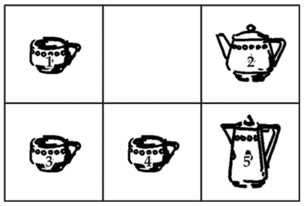

# Задача "Чайный сервиз" (Я. Перельмана)

## Формулировка

Мне пришлось как-то целый вечер ожидать поезда на маленькой станции. Не было ни книг, ни газет, ни собеседников, и я не знал, чем наполнить часы ожидания. К счастью, я вспомнил об одной занимательной задаче, которая незадолго до того попалась мне в иностранном журнале. Задача состояла в следующем.

Стол разграфлен на 6 квадратов, в каждом из которых, кроме одного, помещается какой-нибудь предмет. Я воспользовался чайной посудой и разместил по квадратам 3 чашки, чайник и молочник, как показано на рисунке ниже.

Сущность задачи в том, чтобы взаимно переменить места чайника и молочника, передвигая предметы из одного квадрата в другой по определенным правилам, – а именно:

1. перемещать предмет только в тот квадрат, который окажется свободным;

2. не передвигать предметов по диагонали квадрата;

3. не переносить один предмет поверх другого;

4. не помещать в квадрат более одного предмета, даже временно.

Задача эта имеет много решений, но интересно найти самое короткое, – т. е. обменять местами чайник и молочник в наименьшее число ходов.

В поисках этого кратчайшего решения я не заметил, как прошел вечер; пришлось покинуть станцию, не найдя в тот вечер кратчайшего решения.

Может быть, читатели найдут его? На всякий случай предупреждаю, что искомое "наименьшее" число ходов все же больше дюжины, хотя и меньше полутора дюжин.

## Решение

В результате выполнения скрипта `teaset.py` были получены следующие цепочки:

--- Вариант 1 с числом ходов 16 ---
◆ ⬅, ◇ ⬆, ③ ➡, ② ➡, ① ⬇, ◆ ⬅, ② ⬆, ③ ⬅, ◇ ⬇, ② ➡, ◆ ➡, ① ⬆, ③ ⬅, ◆ ⬇, ② ⬅, ◇ ⬆, ◆ ➡

--- Вариант 2 с числом ходов 16 ---
◆ ⬅, ◇ ⬆, ③ ➡, ◆ ⬇, ① ➡, ② ⬆, ◆ ⬅, ③ ⬅, ◇ ⬇, ① ➡, ③ ⬆, ◆ ➡, ② ⬇, ③ ⬅, ① ⬅, ◇ ⬆, ◆ ➡

--- Вариант 3 с числом ходов 17 ---
③ ⬆, ◇ ⬅, ◆ ⬇, ③ ➡, ① ➡, ② ⬆, ◇ ⬅, ① ⬇, ③ ⬅, ◆ ⬆, ① ➡, ◇ ➡, ② ⬇, ③ ⬅, ◇ ⬆, ① ⬅, ◆ ⬇, ◇ ➡

--- Вариант 4 с числом ходов 17 ---
③ ⬆, ◇ ⬅, ◆ ⬇, ③ ➡, ◇ ⬆, ② ➡, ① ⬇, ◇ ⬅, ③ ⬅, ◆ ⬆, ② ➡, ③ ⬇, ◇ ➡, ① ⬆, ③ ⬅, ② ⬅, ◆ ⬇, ◇ ➡
